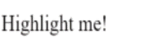

### *Session 10*

# Pipes

# Transforming Data Using Pipes
Use pipes to transform strings, currency amounts, dates, and other data for display. Pipes are simple functions to use in template expressions to accept an input value and return a transformed value. Pipes are useful because you can use them throughout your application, while only declaring each pipe once. For example, you would use a pipe to show a date as __April 15, 1988__ rather than the raw string format.

* DatePipe: Formats a date value according to locale rules.
* UpperCasePipe: Transforms text to all upper case.
* LowerCasePipe: Transforms text to all lower case.
* CurrencyPipe: Transforms a number to a currency string, formatted according to locale rules.
* DecimalPipe: Transforms a number into a string with a decimal point, formatted according to locale rules.
* PercentPipe: Transforms a number to a percentage string, formatted according to locale rules.

Create pipes to encapsulate custom transformations and use your custom pipes in template expressions.

## Using a pipe in a template
To apply a pipe, use the pipe operator (`|`) within a template expression as shown in the following code example, along with the _name_ of the pipe, which is `date` for the built-in `DatePipe`.

`src/app/app.component.html`
```html
<p>The hero's birthday is {{ birthday | date }}</p>
```

`src/app/hero-birthday1.component.ts`
```typescript
import { Component } from '@angular/core';

@Component({
  selector: 'app-hero-birthday',
  template: `<p>The hero's birthday is {{ birthday | date }}</p>`
})
export class HeroBirthdayComponent {
  birthday = new Date(1988, 3, 15); // April 15, 1988 -- since month parameter is zero-based
}
```

The component's `birthday` value flows through the pipe operator, `|` to the `date` function.

<br>

## Transforming data with parameters and chained pipes
Use optional parameters to fine-tune a pipe's output. For example, use the `CurrencyPipe` with a country code such as EUR as a parameter. The template expression `{{ amount | currency:'EUR' }}` transforms the `amount` to currency in euros. Follow the pipe name (`currency`) with a colon (`:`) and the parameter value (`'EUR'`).

If the pipe accepts multiple parameters, separate the values with colons. For example,` {{ amount | currency:'EUR':'Euros '}}` adds the second parameter, the string literal `'Euros '`, to the output string. Use any valid template expression as a parameter, such as a string literal or a component property.

Some pipes require at least one parameter and allow more optional parameters, such as `SlicePipe`. For example,` {{ slice:1:5 }} `creates a new array or string containing a subset of the elements starting with element `1` and ending with element 5.

## Example: Formatting a date
The tabs in the following example demonstrates toggling between two different formats (`'shortDate'` and` 'fullDate'`):


`src/app/app.component.html`
```html
<p>The hero's birthday is {{ birthday | date:"MM/dd/yy" }} </p>
```

`src/app/hero-birthday2.component.ts (template)`
```typescript
template: `
  <p>The hero's birthday is {{ birthday | date:format }}</p>
  <button (click)="toggleFormat()">Toggle Format</button>
`
```
`src/app/hero-birthday.component.ts (class)`
```typescript
export class HeroBirthday2Component {
  birthday = new Date(1988, 3, 15); // April 15, 1988 -- since month parameter is zero-based
  toggle = true; // start with true == shortDate

  get format()   { return this.toggle ? 'shortDate' : 'fullDate'; }
  toggleFormat() { this.toggle = !this.toggle; }
}
```
Clicking the __Toggle Format__ button alternates the date format between __04/15/1988__ and __Friday, April 15, 1988__.

<br>

## Example: Applying two formats by chaining pipes
Chain pipes so that the output of one pipe becomes the input to the next.

In the following example, chained pipes first apply a format to a date value, then convert the formatted date to uppercase characters. The first tab for the `src/app/app.component.html` template chains `DatePipe` and `UpperCasePipe` to display the birthday as __APR 15, 1988__. The second tab for the `src/app/app.component.html` template passes the `fullDate` parameter to `date` before chaining to `uppercase`, which produces __FRIDAY, APRIL 15, 1988__.

`src/app/app.component.html`
```typescript
The chained hero's birthday is
{{ birthday | date | uppercase}}
```

## Create custom pipe

Use the below command to generate a pipe

```
ng generate pipe ExponentialStrength
```

`src/app/exponential-strength.pipe.ts`
```typescript
import { Pipe, PipeTransform } from '@angular/core';
/*
 * Raise the value exponentially
 * Takes an exponent argument that defaults to 1.
 * Usage:
 *   value | exponentialStrength:exponent
 * Example:
 *   {{ 2 | exponentialStrength:10 }}
 *   formats to: 1024
*/
@Pipe({name: 'exponentialStrength'})
export class ExponentialStrengthPipe implements PipeTransform {
  transform(value: number, exponent = 1): number {
    return Math.pow(value, exponent);
  }
}
```

`src/app/power-booster.component.ts`
```typescript
import { Component } from '@angular/core';

@Component({
  selector: 'app-power-booster',
  template: `
    <h2>Power Booster</h2>
    <p>Super power boost: {{2 | exponentialStrength: 10}}</p>
  `
})
export class PowerBoosterComponent { }
```

The browser displays the following:
```
Power Booster

Superpower boost: 1024
```

<br>

# Directives

# Attribute directives
Change the appearance or behavior of DOM elements and Angular components with attribute directives.

## Building an attribute directive
This section walks you through creating a highlight directive that sets the background color of the host element to yellow.

1.  To create a directive, use the CLI command `ng generate directive`.

```
ng generate directive highlight
```
The CLI creates `src/app/highlight.directive.ts`, a corresponding test file `src/app/highlight.directive.spec.ts`, and declares the directive class in the `AppModule`.

The CLI generates the default `src/app/highlight.directive.ts` as follows:

`src/app/highlight.directive.ts`
```typescript
import { Directive } from '@angular/core';

@Directive({
  selector: '[appHighlight]'
})
export class HighlightDirective {
  constructor() { }
}
```
The `@Directive()` decorator's configuration property specifies the directive's CSS attribute selector, `[appHighlight]`.

2. Import `ElementRef` from `@angular/core`. `ElementRef` grants direct access to the host DOM element through its `nativeElement` property.

3. Add `ElementRef` in the directive's `constructor()` to inject a reference to the host DOM element, the element to which you apply `appHighlight`.

4. Add logic to the `HighlightDirective` class that sets the background to yellow.

`src/app/highlight.directive.ts`

```ts
import { Directive, ElementRef } from '@angular/core';

@Directive({
  selector: '[appHighlight]'
})
export class HighlightDirective {
    constructor(el: ElementRef) {
       el.nativeElement.style.backgroundColor = 'yellow';
    }
}
```
>Directives do not support namespaces.
>
> `src/app/app.component.avoid.html (unsupported)`
> ```html
> <p app:Highlight>This is invalid</p>
> ```

## Applying an attribute directive
1. To use the `HighlightDirective`, add a `<p>` element to the HTML template with the directive as an attribute.
`src/app/app.component.html`
```html
<p appHighlight>Highlight me!</p>
```
Angular creates an instance of the `HighlightDirective` class and injects a reference to the `<p>` element into the directive's constructor, which sets the `<p>` element's background style to yellow.

## Handling user events
This section shows you how to detect when a user mouses into or out of the element and to respond by setting or clearing the highlight color.

1. Import `HostListener` from '@angular/core'.

`src/app/highlight.directive.ts (imports)`
```ts
import { Directive, ElementRef, HostListener } from '@angular/core';
```

2. Add two event handlers that respond when the mouse enters or leaves, each with the `@HostListener()` decorator.

`src/app/highlight.directive.ts (mouse-methods)`

```ts
@HostListener('mouseenter') onMouseEnter() {
  this.highlight('yellow');
}

@HostListener('mouseleave') onMouseLeave() {
  this.highlight('');
}

private highlight(color: string) {
  this.el.nativeElement.style.backgroundColor = color;
}
```
Subscribe to events of the DOM element that hosts an attribute directive, the `<p>` in this case, with the `@HostListener()` decorator.

The handlers delegate to a helper method, `highlight()`, that sets the color on the host DOM element, `el`.

The complete directive is as follows:

` src/app/highlight.directive.ts`

```ts
@Directive({
  selector: '[appHighlight]'
})
export class HighlightDirective {

  constructor(private el: ElementRef) { }

  @HostListener('mouseenter') onMouseEnter() {
    this.highlight('yellow');
  }

  @HostListener('mouseleave') onMouseLeave() {
    this.highlight('');
  }

  private highlight(color: string) {
    this.el.nativeElement.style.backgroundColor = color;
  }

}
```
The background color appears when the pointer hovers over the paragraph element and disappears as the pointer moves out.



## Passing values into an attribute directive
This section walks you through setting the highlight color while applying the `HighlightDirective`.

1. In `highlight.directive.ts`, import `Input` from `@angular/core`.

`src/app/highlight.directive.ts (imports)`
```ts
import { Directive, ElementRef, HostListener, Input } from '@angular/core';
```
2. Add an `appHighlight @Input()` property.

`src/app/highlight.directive.ts`
```ts
@Input() appHighlight = '';
```
The `@Input()` decorator adds metadata to the class that makes the directive's `appHighlight` property available for binding.

3. In app.component.ts, add a color property to the AppComponent.
`src/app/app.component.ts (class)`
```ts
export class AppComponent {
  color = 'yellow';
}
```
4. To simultaneously apply the directive and the color, use property binding with the `appHighlight` directive selector, setting it equal to `color`.

`src/app/app.component.html (color)`

```html
<p [appHighlight]="color">Highlight me!</p>
```

The `[appHighlight]` attribute binding performs two tasks:

* applies the highlighting directive to the `<p>` element
* sets the directive's highlight color with a property binding

### *End of session 10*