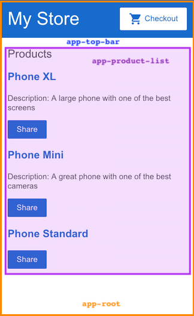

### *Session 3*

# Getting started with Angular

This guide demonstrates building an application with the following components.

`<app-root>` — the first component to load and the container for the other components.

`<app-top-bar>` — the store name and checkout button.

`<app-product-list>` — the product list.

`<app-product-alerts>` — a component that contains the application's alerts.



---

## Create the sample project

To create the sample project you must have angular cli installed in your system, and use the below command to create

```
ng new product-app
cd product-app
```

Open the folder in Visual Studio Code and start building the application.

# Create the product list

Use the below command to create a new component:

```
ng generate component product-list
```

Edit the `product-list.component.ts` file with the below code:

```typescript
import { Component } from '@angular/core';

import { products } from '../products';

@Component({
  selector: 'app-product-list',
  templateUrl: './product-list.component.html',
  styleUrls: ['./product-list.component.css']
})
export class ProductListComponent {
  products = products;

  share() {
    window.alert('The product has been shared!');
  }
}
```

Also create another file called `product.ts` to export some product data.

```typescript
export interface Product {
  id: number;
  name: string;
  price: number;
  description: string;
}

export const products = [
  {
    id: 1,
    name: 'Phone XL',
    price: 799,
    description: 'A large phone with one of the best screens'
  },
  {
    id: 2,
    name: 'Phone Mini',
    price: 699,
    description: 'A great phone with one of the best cameras'
  },
  {
    id: 3,
    name: 'Phone Standard',
    price: 299,
    description: ''
  }
];

```

Update the application to display a list of products. You'll use predefined product data from the `products.ts` file and methods from the `product-list.component.ts` file. This section guides you through editing the HTML, also known as the template.

**1.** In the `product-list` folder, open the template file `product-list.component.html`.

**2.** Add an `*ngFor` structural directive on a &lt;div&gt;, as follows.

`src/app/product-list/product-list.component.html`
```html
<h2>Products</h2>

<div *ngFor="let product of products">
</div>
```

With `*ngFor`, the &lt;div&gt; repeats for each product in the list.

Structural directives shape or reshape the DOM's structure, by adding, removing, and manipulating elements.

**3.** Inside the &lt;div&gt;, add an &lt;h3&gt; and `{{ product.name }}`. The `{{ product.name }}` statement is an example of Angular's interpolation syntax. Interpolation `{{ }}` lets you render the property value as text.

`src/app/product-list/product-list.component.html`
```html
<h2>Products</h2>

<div *ngFor="let product of products">

  <h3>
      {{ product.name }}
  </h3>

</div>
```

The preview pane updates to display the name of each product in the list.


**4.** To make each product name a link to product details, add the &lt;a&gt; element around `{{ product.name }}`.

**5.** Set the title to be the product's name by using the property binding `[ ]` syntax, as follows:

`src/app/product-list/product-list.component.html`
```html
<h2>Products</h2>

<div *ngFor="let product of products">

  <h3>
    <a [title]="product.name + ' details'">
      {{ product.name }}
    </a>
  </h3>

</div>
```

**6.** Add the product descriptions. On a &lt;p&gt; element, use an `*ngIf` directive so that Angular only creates the &lt;p&gt; element if the current product has a description.

`src/app/product-list/product-list.component.html`
```html
<h2>Products</h2>

<div *ngFor="let product of products">

  <h3>
    <a [title]="product.name + ' details'">
      {{ product.name }}
    </a>
  </h3>

  <p *ngIf="product.description">
    Description: {{ product.description }}
  </p>

</div>
```

The application now displays the name and description of each product in the list. Notice that the final product does not have a description paragraph. Angular doesn't create the &lt;p&gt; element because the product's description property is empty.

**7.** Add a button so users can share a product. Bind the button's `click` event to the `share()` method in `product-list.component.ts.` Event binding uses a set of parentheses, `( )`, around the event, as in the `(click)` event on the &lt;button&gt; element.

`src/app/product-list/product-list.component.html`
```html
<h2>Products</h2>

<div *ngFor="let product of products">

  <h3>
    <a [title]="product.name + ' details'">
      {{ product.name }}
    </a>
  </h3>

  <p *ngIf="product.description">
    Description: {{ product.description }}
  </p>

  <button (click)="share()">
    Share
  </button>

</div>
```

Each product now has a __Share__ button.

Clicking the Share button triggers an alert that states, "The product has been shared!".

<br>

### *End of session 3*