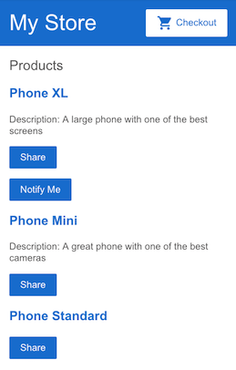

### *Session 4*

# Pass data to a child component

Currently, the product list displays the name and description of each product. The `ProductListComponent` also defines a `products` property that contains imported data for each product from the `products` array in `products.ts`.

The next step is to create a new alert feature that uses product data from the `ProductListComponent`. The alert checks the product's price, and, if the price is greater than $700, displays a **Notify Me** button that lets users sign up for notifications when the product goes on sale.

This section walks you through creating a child component, `ProductAlertsComponent` that can receive data from its parent component, `ProductListComponent`.

**1.** Click on the plus sign above the current terminal to create a new terminal to run the command to generate the component.

**2.** In the new terminal, generate a new component named product-alerts by running the following command.

```
ng generate component product-alerts
```
The generator creates starter files for the three parts of the component:

* `product-alerts.component.ts`
* `product-alerts.component.html`
* `product-alerts.component.css`

**3.** Open `product-alerts.component.ts`. The `@Component()` decorator indicates that the following class is a component. `@Component()` also provides metadata about the component, including its selector, templates, and styles.

`src/app/product-alerts/product-alerts.component.ts`
``` typescript
import { Component, OnInit } from '@angular/core';

@Component({
  selector: 'app-product-alerts',
  templateUrl: './product-alerts.component.html',
  styleUrls: ['./product-alerts.component.css']
})
export class ProductAlertsComponent implements OnInit {

  constructor() { }

  ngOnInit() {
  }

}
```

Key features in the `@Component()` are as follows:

* The `selector`, `app-product-alerts`, identifies the component. By convention, Angular component selectors begin with the prefix `app-`, followed by the component name.

* The template and style filenames reference the component's `HTML` and `CSS`.

* The `@Component()` definition also exports the class, `ProductAlertsComponent`, which handles functionality for the component.

<br>

**4.** To set up `ProductAlertsComponent` to receive product data, first import Input from `@angular/core`

`src/app/product-alerts/product-alerts.component.ts`
```typescript
import { Component, OnInit, Input } from '@angular/core';
import { Product } from '../products';
```

**5.** In the `ProductAlertsComponent` class definition, define a property named product with an `@Input()` decorator. The `@Input()` decorator indicates that the property value passes in from the component's parent, `ProductListComponent`.

`src/app/product-alerts/product-alerts.component.ts`
```typescript
export class ProductAlertsComponent implements OnInit {

  @Input() product!: Product;
  constructor() { }

  ngOnInit() {
  }

}
```

**6.** Open `product-alerts.component.html` and replace the placeholder paragraph with a Notify Me button that appears if the product price is over `$700`.

`src/app/product-alerts/product-alerts.component.html`
```html
<p *ngIf="product && product.price > 700">
  <button>Notify Me</button>
</p>
```

**7.** The generator automatically added the `ProductAlertsComponent` to the `AppModule` to make it available to other components in the application.

`src/app/app.module.ts`
```typescript
import { ProductAlertsComponent } from './product-alerts/product-alerts.component';

@NgModule({
  declarations: [
    AppComponent,
    TopBarComponent,
    ProductListComponent,
    ProductAlertsComponent,
  ],
```

**8.** Finally, to display `ProductAlertsComponent` as a child of `ProductListComponent`, add the `<app-product-alerts>` element to `product-list.component.html`. Pass the current product as input to the component using property binding.

`src/app/product-list/product-list.component.html`
```html
<button (click)="share()">
  Share
</button>

<app-product-alerts
  [product]="product">
</app-product-alerts>
```

The new product alert component takes a product as input from the product list. With that input, it shows or hides the **Notify Me** button, based on the price of the product. The Phone XL price is over $700, so the **Notify Me** button appears on that product.



<br>

# Pass data to a parent component

To make the **Notify Me** button work, the child component needs to notify and pass the data to the parent component. The `ProductAlertsComponent` needs to emit an event when the user clicks **Notify Me** and the `ProductListComponent` needs to respond to the event.

<br>

> In new components, the Angular Generator includes an empty `constructor()`, the `OnInit` interface, and the `ngOnInit()` method. Since these steps don't use them, the following code examples omit them for brevity.

<br>

**1.** In `product-alerts.component.ts`, import `Output` and `EventEmitter` from `@angular/core`.

`src/app/product-alerts/product-alerts.component.ts`
```typescript
import { Component, Input, Output, EventEmitter } from '@angular/core';
import { Product } from '../products';
```

**2.** In the component class, define a property named notify with an `@Output()` decorator and an instance of `EventEmitter()`. Configuring `ProductAlertsComponent` with an `@Output()` allows the `ProductAlertsComponent` to emit an event when the value of the notify property changes.

`src/app/product-alerts/product-alerts.component.ts`
```typescript
export class ProductAlertsComponent {
  @Input() product: Product | undefined;
  @Output() notify = new EventEmitter();
}
```

**3.** In `product-alerts.component.html`, update the Notify Me button with an event binding to call the `notify.emit()` method.

`src/app/product-alerts/product-alerts.component.html`
```html
<p *ngIf="product && product.price > 700">
  <button (click)="notify.emit()">Notify Me</button>
</p>
```

**4.** Define the behavior that happens when the user clicks the button. The parent, `ProductListComponent` — not the `ProductAlertsComponent` — acts when the child raises the event. In `product-list.component.ts`, define an `onNotify()` method, similar to the `share()` method.

`src/app/product-list/product-list.component.ts`
```typescript
export class ProductListComponent {

  products = products;

  share() {
    window.alert('The product has been shared!');
  }

  onNotify() {
    window.alert('You will be notified when the product goes on sale');
  }
}
```

**5.** Update the `ProductListComponent` to receive data from the `ProductAlertsComponent`.

In `product-list.component.html`, bind `<app-product-alerts>` to the `onNotify()` method of the product list component. `<app-product-alerts>` is what displays the Notify Me button.

`src/app/product-list/product-list.component.html`
```html
<button (click)="share()">
  Share
</button>

<app-product-alerts
  [product]="product" 
  (notify)="onNotify()">
</app-product-alerts>
```

**6.** Click the **Notify Me** button to trigger an alert which reads, "You will be notified when the product goes on sale".

<br>

## ✅ Tasks

✅ Create a new component called `laptop-alerts-component` similar to above.

✅ Enable the `laptops-alerts-component` to receive Laptop as property with an `@Input()` decorator.

✅ Perform all the other steps followed in the current session in the project `computer-store`.

### *End of session 4*

### [NEXT: Session5](session5.md)