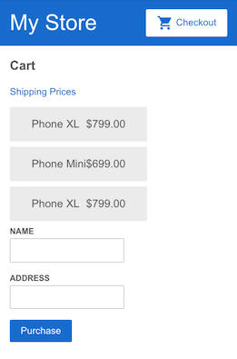

### *Session 8*

# Create a shipping component

Now that you've configured your application to retrieve shipping data, you can create a place to render that data.

1. Generate a cart component named `shipping` in the terminal by running the following command:

    ```
    ng generate component shipping
    ```

    This command will generate the `shipping.component.ts` file and it associated template and styles files.

    `src/app/shipping/shipping.component.ts`

    ```typescript
    import { Component } from '@angular/core';

    @Component({
        selector: 'app-shipping',
        templateUrl: './shipping.component.html',
        styleUrls: ['./shipping.component.css']
    })
    export class ShippingComponent {

        constructor() { }

    }
    ```

2. In `app.module.ts`, add a route for shipping. Specify a path of shipping and a component of `ShippingComponent`.

    `src/app/app.module.ts`
    ```typescript
    @NgModule({
    imports: [
        BrowserModule,
        HttpClientModule,
        ReactiveFormsModule,
        RouterModule.forRoot([
        { path: '', component: ProductListComponent },
        { path: 'products/:productId', component: ProductDetailsComponent },
        { path: 'cart', component: CartComponent },
        { path: 'shipping', component: ShippingComponent },
        ])
    ],
    declarations: [
        AppComponent,
        TopBarComponent,
        ProductListComponent,
        ProductAlertsComponent,
        ProductDetailsComponent,
        CartComponent,
        ShippingComponent
    ],
    bootstrap: [
        AppComponent
    ]
    })
    export class AppModule { }
    ```

    There's no link to the new shipping component yet, but you can see its template in the preview pane by entering the URL its route specifies. The URL has the pattern: `https://angular-ynqttp--4200.local.webcontainer.io/shipping` where the `angular-ynqttp--4200.local.webcontainer.io` part may be different for your StackBlitz project.

## Configuring the `ShippingComponent` to use `CartService`

This section guides you through modifying the `ShippingComponent` to retrieve shipping data via HTTP from the `shipping.json` file.

1. In `shipping.component.ts`, import `CartService`

    `src/app/shipping/shipping.component.ts`
    ```typescript
    import { Component } from '@angular/core';

    import { CartService } from '../cart.service';
    ```

2. Inject the cart service in the `ShippingComponent` `constructor()`.

    `src/app/shipping/shipping.component.ts`
    ```typescript
    constructor(private cartService: CartService) { }
    ```

3. Define a `shippingCosts` property that sets the `shippingCosts` property using the `getShippingPrices()` method from the `CartService`.

    `src/app/shipping/shipping.component.ts`
    ```typescript
    export class ShippingComponent {

        shippingCosts = this.cartService.getShippingPrices();
    }
    ```

4. Update the `ShippingComponent` template to display the shipping types and prices using the `async` pipe.

    `src/app/shipping/shipping.component.html`
    ```html
    <h3>Shipping Prices</h3>

    <div class="shipping-item" *ngFor="let shipping of shippingCosts | async">
        <span>{{ shipping.type }}</span>
        <span>{{ shipping.price | currency }}</span>
    </div>
    ```
    The `async` pipe returns the latest value from a stream of data and continues to do so for the life of a given component. When Angular destroys that component, the `async` pipe automatically stops.

5. Add a link from the `CartComponent` view to the `ShippingComponent` view.

    `src/app/cart/cart.component.html`
    ```html
    <h3>Cart</h3>

    <p>
        <a routerLink="/shipping">Shipping Prices</a>
    </p>

    <div class="cart-item" *ngFor="let item of items">
        <span>{{ item.name }}</span>
        <span>{{ item.price | currency }}</span>
    </div>
    ```

6. Click the **Checkout** button to see the updated cart. Remember that changing the application causes the preview to refresh, which empties the cart.

<br>

# Using forms for user input

This section walks you through adding a form-based checkout feature to collect user information as part of checkout.

# Define the checkout form model

This step shows you how to set up the checkout form model in the component class. The form model determines the status of the form.

1. Open `cart.component.ts`.

2. Import the `FormBuilder` service from the `@angular/forms` package. This service provides convenient methods for generating controls.

    `src/app/cart/cart.component.ts`
    ```typescript
    import { Component } from '@angular/core';
    import { FormBuilder } from '@angular/forms';

    import { CartService } from '../cart.service';
    ```

3. Inject the `FormBuilder` service in the `CartComponent` `constructor()`. This service is part of the `ReactiveFormsModule` module, which you've already imported.

    `src/app/cart/cart.component.ts`
    ```typescript
    export class CartComponent {

    constructor(
        private cartService: CartService,
        private formBuilder: FormBuilder,
    ) {}
    }
    ```

4. To gather the user's name and address, use the `FormBuilder` `group()` method to set the `checkoutForm` property to a form model containing `name` and `address` fields.

    `src/app/cart/cart.component.ts`
    ```typescript
    export class CartComponent {

    items = this.cartService.getItems();

    checkoutForm = this.formBuilder.group({
        name: '',
        address: ''
    });

    constructor(
        private cartService: CartService,
        private formBuilder: FormBuilder,
    ) {}
    }
    ```

5. Define an `onSubmit()` method to process the form. This method allows users to submit their name and address. In addition, this method uses the `clearCart()` method of the `CartService` to reset the form and clear the cart.

    The entire cart component class is as follows:

    `src/app/cart/cart.component.ts`

    ```typescript
    import { Component } from '@angular/core';
    import { FormBuilder } from '@angular/forms';

    import { CartService } from '../cart.service';

    @Component({
        selector: 'app-cart',
        templateUrl: './cart.component.html',
        styleUrls: ['./cart.component.css']
    })
    export class CartComponent {

        items = this.cartService.getItems();

        checkoutForm = this.formBuilder.group({
            name: '',
            address: ''
        });

        constructor(
            private cartService: CartService,
            private formBuilder: FormBuilder,
        ) {}

        onSubmit(): void {
            // Process checkout data here
            this.items = this.cartService.clearCart();
            console.warn('Your order has been submitted', this.checkoutForm.value);
            this.checkoutForm.reset();
        }
    }
    ```

# Create the checkout form

Use the following steps to add a checkout form at the bottom of the Cart view.

1. At the bottom of `cart.component.html`, add an HTML `<form>` element and a **Purchase** button.

2. Use a `formGroup` property binding to bind `checkoutForm` to the HTML `<form>`.

    `src/app/cart/cart.component.html`
    ```html
    <form [formGroup]="checkoutForm">

        <button class="button" type="submit">Purchase</button>

    </form>
    ```

3. On the `form` tag, use an `ngSubmit` event binding to listen for the form submission and call the `onSubmit()` method with the `checkoutForm` value.

    `src/app/cart/cart.component.html (cart component template detail)`
    ```html
    <form [formGroup]="checkoutForm" (ngSubmit)="onSubmit()">
    </form>
    ```

4. Add `<input>` fields for name and address, each with a `formControlName` attribute that binds to the `checkoutForm` form controls for `name` and `address` to their `<input>` fields. The complete component is as follows:

    `src/app/cart/cart.component.html`
    ```html
    <h3>Cart</h3>

    <p>
        <a routerLink="/shipping">Shipping Prices</a>
    </p>

    <div class="cart-item" *ngFor="let item of items">
        <span>{{ item.name }} </span>
        <span>{{ item.price | currency }}</span>
    </div>

    <form [formGroup]="checkoutForm" (ngSubmit)="onSubmit()">

        <div>
            <label for="name">
                Name
            </label>
            <input id="name" type="text" formControlName="name">
        </div>

        <div>
            <label for="address">
                Address
            </label>
            <input id="address" type="text" formControlName="address">
        </div>

        <button class="button" type="submit">Purchase</button>

    </form>
    ```

After putting a few items in the cart, users can review their items, enter their name and address, and submit their purchase.



To confirm submission, open the console to see an object containing the name and address you submitted.

## ✅ Tasks

✅ Create the shipping implementation in the `computer-store` project with all the above steps.

### *End of session 8*

### [NEXT: Session9](session9.md)